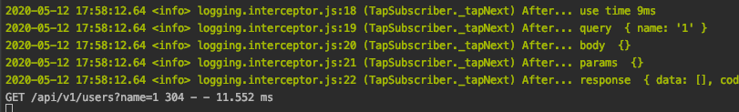
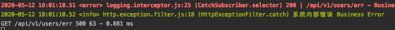

Logger 建议使用 Nest 自带的 Logger 系统，如果你有更复杂的日志需求建议你使用 `@kalengo/utils/logger`

在 全局或者 static 域中使用 Logger

```ts
import { Logger } from '@nestjs/common'

Logger.debug('hello')
Logger.info('hello')

```

在 class 中使用 Logger

```ts
@Injectable()
export class RolesGuard implements CanActivate {
  logger = new Logger(RolesGuard.name)
  async canActivate(context: ExecutionContext): Promise<boolean> {
    this.logger.debug('hello')
  }
}
```

更多细节请看 Nest 官方文档 [日志](https://docs.nestjs.cn/7/techniques?id=%e6%97%a5%e5%bf%97)

## 自定义 request log
我们可能会有这样的需求，需要收集

- request 时间
- request 的参数
- response 的内容

等等, 我们可以通过编写全局拦截器来实现
> src/common/interceptor/logging.interceptor.ts
```ts
import {
  Injectable,
  NestInterceptor,
  ExecutionContext,
  CallHandler
} from '@nestjs/common'
import { Observable, throwError } from 'rxjs'
import { tap, catchError } from 'rxjs/operators'
import { logger } from '@kalengo/utils'

@Injectable()
export class LoggingInterceptor implements NestInterceptor {
  intercept(context: ExecutionContext, next: CallHandler): Observable<any> {
    const request = context.switchToHttp().getRequest()
    const now = Date.now()
    return next.handle().pipe(
      tap((data) => {
        logger.info(`After... use time ${Date.now() - now}ms`)
        logger.info(`After... query `, request.query)
        logger.info(`After... body `, request.body)
        logger.info(`After... params `, request.params)
        logger.info(`After... response `, data)
      }),
      catchError((error) => {
        const response = context.switchToHttp().getResponse()
        logger.error(
          `${response.statusCode} | ${request.url} - ${error.message} - ${
            Date.now() - now
          }ms`
        )
        return throwError(error)
      })
    )
  }
}

```
我们可以很轻松地通过 context 获得 express 的 request 和 response，这样就可以获得我们需要的所有信息了。

不过这里有个难受的点，在 Observable 对象中，好像没办法同时在 catchError 的时候还获得 response 的 data，
如果有对 rxjs 比较熟悉的同学，你知道如何做到的话，欢迎指教。

目前只能把正常和异常两种情况分开写

之后在全局注入中间件
```ts
import { Module } from '@nestjs/common'
import { UsersModule } from './users/users.module'
import { LoggingInterceptor } from './common/interceptor/logging.interceptor'
import { APP_INTERCEPTOR } from '@nestjs/core'

@Module({
  imports: [UsersModule],
  providers: [
    {
      provide: APP_INTERCEPTOR,
      useClass: LoggingInterceptor
    }
  ]
})
export class ApplicationModule {}

```
启动应用，看看效果

请求正常


请求异常


## 日志写入文件并按日分割
这里推荐使用 `@kalengo/utils/logger`, 具体配置见[该 logger 的文档](https://kaolalicai.github.io/nest_doc/utils.html#logger)
