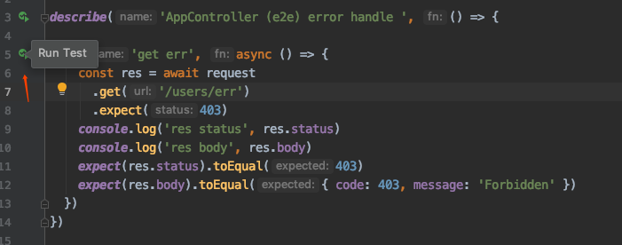

Nest 的官方 demo 中提供了两套测试：

- Unit Test
- E2E Test

一个业务要写 E2E Test 还是 Unit Test 要根据实际情况来分析。
建议：
- 主流程（成功/失败）：E2E Test
- 异常 case : Unit Test

接下来和大家详细解释一下两套测试

## Unit Test
即是单元测试，测试粒度非常小，一般是测试一个 function，可以测很多种 case，
代价 function 的外部依赖都需要 mock 掉，如其他 function 调用数据查询等。

这里我们将会参考 Nest 的风格:
- Unit Test 文件位置和代码同个位置，以后缀区分
- 测试粒度是 function
- 测试不会连接 mongodb

如果你发现测试一个 service function 的时候，不连着  mongodb 就不好写测试的时候，就要考虑修改一下代码结构了，把数据查询的逻辑独立到另一个方法去。
毕竟业界是有 “编写可测试的代码” 这个说法的。

执行测试
```bash
$ npm run test
```

## E2E Test
端到端测试，测试粒度比较大，模拟请求接口，然后检查返回值，好处是测试覆盖的流程多，
用比较低的成本就可以获得 80% 以上的覆盖率，坏处是不够灵活。

而且为了能覆盖到数据查询的流程，我们的习惯是连着 mongodb 跑的，
这里我们就不参考  Nest 的风格了。

E2E Test 依赖 mongodb，所以开始之前请修改 config/test.js 里的 mongodb uri

执行测试

```bash
$ npm run test:e2e
```

## 准备测试数据
根据我们之前的经验，我们发现 mock mongodb db 的成本比较高，不如直接连着 mongodb 测试。

但是这种做法要求测试之前我们要准备好的基础数据，这个基础数据有个专有名词，叫 Fixtures。

在之前的开发经验中，我们会选择新建一个文件来保存 Fixtures。例如测试文件是：
`test/users/users-find.e2e-spec.ts`
则新建一个
`test/users/users-find.e2e-spec.data.ts`
里面保存每个 Model 的数据，在测试开始之前，data 会被写入 DB，测试结束的时候清理掉。

不过现在使用了 jest 测试框架，因为 jest 不会暴露运行时状态，所以无法继续使用上述方式准备 Fixtures 了，
只能在每个测试文件开头处，声明 Fixtures。

```ts
describe('AppController (e2e) find with fixtures ', () => {
  beforeAll(async function () {
    await genFixtures(UserTemplate, 10, 'User')
  })

  it('find all', () => {
    request
      .get('/users')
      .expect(200)
  })
})
```

声明 `await genFixtures(UserTemplate, 10, 'User')` 之后，数据库就会生成 10 个用户数据.

UserTemplate 长这样：
```ts
export const UserTemplate = {
  _id: () => ObjectId(),
  'name': () => Mock.Random.first(),
  phone: /1\d{10}/
}
```
这里依赖了 mockjs 帮忙把 UserTemplate 模板生成实际数据，再通过我们封装好的 genFixtures 方法把数据写入 DB 中

如果你需要生成多个表的数据，并且还需要指定数据之间的关联关系，可以参考 test/users/users-multi-db.e2e-spec.ts 这个测试的实现：

> test/users/users-multi-db.e2e-spec.ts

```ts
beforeAll(async function () {
    // 自动生成 User fixture
    let userData = await genFixtures(UserTemplate, 1, 'User')
    user = userData[0]
    userId = user._id.toString()

    // 自动生成 Account fixture，并且通过 fixData 函数来修改值
    await genFixtures(AccountTemplate, 1, 'Account', (it: any) => {
      it.userId = userId
      return it
    })
  })
```
生成 Account  的时候修改一下 UserId

## Mock Service
如果测试中需要 mock service 方法，可以参考

> sample/hello-world/test/users/users-register.e2e-spec.ts

```ts
it('register with service mock', async () => {
    let usersService = testModule.get<UsersService>(UsersService)
    let spy = jest.spyOn(usersService, 'register').mockImplementation(async () => ({mock: true} as any))
    let {body} = await request
      .post('/users/register')
      .send({name: 'nick', phone: '12345'})
      .expect(201)
      .expect({
        'code': 0,
        'message': 'success',
        'data': {
          'mock': true
        }
      })
    console.log('body', body)
    expect(spy).toHaveBeenCalled()
    // 一定要 restore 不然会影响其他测试
    spy.mockRestore()
})
```
因为 nestjs 里依赖注入的对象是单例的，我们从容器里取出 usersService 后，
使用 jest.spyOn 监听和修改 register 方法，是可以全局生效的。

**注意**记得在测试结束的时候 `spy.mockRestore()`

## 无法快速运行测试的问题
脚手架里实际存在了两套测试，所以 e2e 测试无法继续享受 WebStorm 点击快速运行测试的便利了。



这里点击测试的话，会得到如下结果：

> No tests found, exiting with code 1

> Run with `--passWithNoTests` to exit with code 0

这是因为 Webstorm 默认读取的是 package.json 中 jest 的配置信息，但是这个测试是 unit test 的，所以会找不到测试文件。

如果需要快速 run  test 这个功能, 可以考虑配置一下 jest 的 run 模板
把 `--config ./test/jest-e2e.json` 作为固定参数写入模板中。

